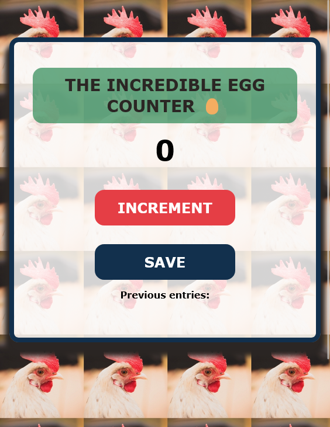

 ## Table of contents

- [Overview](#overview)
  - [The challenge](#the-challenge)
  - [Screenshot](#screenshot)
  - [Links](#links)
- [My process](#my-process)
  - [Built with](#built-with)
  - [What I learned](#what-i-learned)
  - [Continued development](#continued-development)
  - [Useful resources](#useful-resources)
- [Author](#author)
- [Acknowledgments](#acknowledgments)


### Overview
- Scrimba Module 3 JavaScript counter app from the Frontend Developer Career Path
https://scrimba.com


### The challenge

Make it Your own
 - Title (choose something that interests you)
 - Background image
 - Font (from list)
 - Button colors and appearance (width, border, etc)
 - Wrap a div around the HTML, add a max-width

 ### Screenshot
 

### Links

- Scrim: [Scrim](https://scrimba.com/scrim/co66f4672bc42a373fbd1968f)
- Github: [Github](https://github.com/casserole27/counter-app)
- Live Site: [Live Site](https://www.clewisdev.com/counter-app/)

## My process

Create Github repository
- initialize README

Setup basic HTML file 
- insert my personal comment credit
- head tag includes stylesheet/link and fonts, double check for meta viewport tag
- initial semantic, accessible markup: placing main, heading and paragraph tags
 - commit and push

Setup basic CSS file
- insert my personal comment credit
- decide on mobile or desktop-first design based on design file examples
- set up root selector with variables: colors, border radius, and font size
- margin, padding, box-size reset, root
- decide on global styles
- commit and push

Consult Figma design files
 - use rems or ems
 - adjust text properties: size, line height, color
 - insert images and color properties
 - decide on layout tools and markup accordingly
 - add effects: borders, box shadows, etc
 - commit and push after each major change

Publish live URL

Check markup and accessibility
(https://validator.w3.org/)
(https://wave.webaim.org/)
 - make adjustments as necessary
 - commit and push
 - finish README


### Built with

- CSS custom properties
- Responsive Web Design

### What I learned

I'm excited to get back into JS and continue to learn how HTML, CSS, and JS work together.


```javascript

countEl.innerText = count
//vs.
countEl.textContent = count

//textContent isn't parsed as HTML

```

### Continued development


### Useful resources


## Author

- Website - [C Lewis](https://www.clewisdev.com)
- LinkedIn - [LinkedIn](https://www.linkedin.com/in/clewisdev/)


## Acknowledgments


